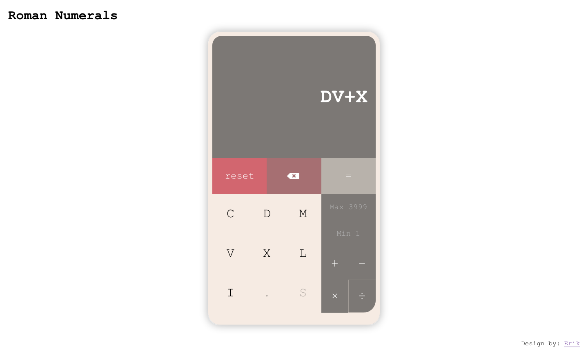

# Roman Numerals App

## Setup

Make sure you have node installed, then run `npm instally`

## Run locally

To run the project locally run npm start You can then open the project on [http://localhost:3000](http://localhost:3000) in the browser.

## Build

To build the project run `npm run build`.

Builds the app for production to the `build` folder.
